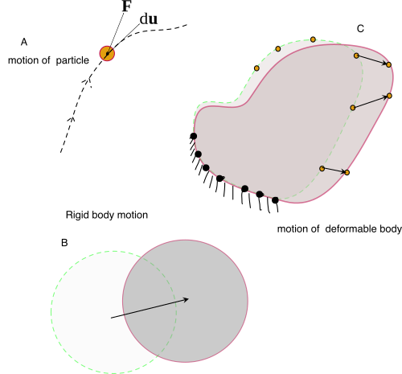

# 𑗕 Work, Heat and Energy

This chapter deal with the concept of conservation of energy, which is also known as the first law of thermodynamics. The concept of **heat and work**, which are fundamental ingredients of mechanics, are explained. It should be remember that the surrounding interacts with the system by exchanging the energy through heat and mechanical work. **Internal energy** is a state dependent property of the system which represents the total energy of the system. Subsequently, work done by thermodynamic pressure, heat capacity, enthalpy, and Joule-Thomson effect are discussed.

## Close and open system

- A *close system* cannot exchange mass with its surrounding (or universe).
- An *open system* is allowed to exchange mass and energy with the surroundings.
- It noteworthy that both open and closed systems can exchange energy with the surroundings.

## Work

In mechanics work, $W$​, done by a force $\mathbf{F}$ on a body $\mathfrak{B}$​ is defined as the scalar product between the force and the displacement at the point of application of the force (see, Figure 1a).

$$
dW:= \mathbf{F} \cdot d\mathbf{u}
$$

From the above definition, it is clear that, for the force to perform work, the point of application should move along the line of action of the force. The work done by the force can be positive or negative. The work is positive when the displacement of the point is in the direction of the force, and it is negative when the displacement is in the opposite direction of the force.

It is important to note that, in the case of a rigid body, the work done by a force displaces the center of the body's mass. In this way, the body's boundary simply performs rigid body motion. In the case of a deformable body, the force can also deform the body such that its volume changes. Whenever a deformable body's volume changes, its boundary must move to accommodate the new volume. It is also possible for a deformable body to undergo rigid body motion; in this case, the boundary also performs rigid body motion.

Figure 1: Representation of  deformation of different bodies

The force acting on a body is exerted by its surrounding. Therefore, we can say that the surrounding is working on the system. In thermodynamics, the work done by the system will be denoted by $W$. If $W>0$, then it means that the system is giving some of its energy to its surroundings. Also, $W<0$ implies that the system receives energy from its surroundings. The most important thing to note is that work done on a system or by a system represent energy exchange mechanisms between the system and its surrounding.

Let $\mathbf{F}$​  be the force exerted by the surrounding on the system or the body at some point on the surface of the body. Let us denote the displacement of this point by $d\mathbf{u}$​. Then, the work done by the force (or surrounding) on the body is given by $\mathbf{F}\cdot d\mathbf{u}$​​. However, the work done by the system will be negative to work done by the surrounding, and the following equation will give it.

$$
W :=-\int \mathbf{F} \cdot d\mathbf{u}
$$

Why is there a negative sign? The work done by the force is positive when the displacement of the point of application is in the direction of the force's application; in this case, the force provides energy to the body. But we know that when the energy is supplied to the system, we use a negative sign to represent it. Therefore, we have used the negative sign in the above equation. In this way, when the work done by the force is negative, it means the displacement of the point of application is in the opposite direction of the direction of force, and the surrounding will be extracting energy from the system. We present energy extraction from the system by denoting work as positive. The amount of work done by a force on a body depends upon the path taken (trajectory) during the motion.

## Energy

A system's energy is the system's capacity to perform work. Therefore, when an isolated system performs work, then its energy decreases.

In an **exothermic** process, the system releases energy, which is then transferred to its surrounding. In an **endothermic** process, the system absorbs the energy. Therefore, the energy migrates from the surroundings to the system. The combustion of methane is an example of the exothermic process, and the melting of ice is a process of endothermic process.

## Heat

Heat is a process of transferring energy from a hot body to a cool body. Note that heat is not an entity like energy. For the same reason, heat cannot be stored. The energy of a system can be increased by providing heat to it. Also, it is possible to decrease the energy of a system by taking heat from it.
