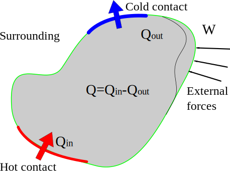

# 𑗕 First law of thermodynamics

The first law of thermodynamics states that we can provide energy to a closed system by performing work on the system and/or providing heat to it. Recall that positive work done by the surroundings implies energy is being supplied to the system. We can also provide energy to the body by putting it in contact with another object with a higher temperature. This way, heat will transfer from the high to the lower temperature regime. We can also extract the heat from the body by putting it in contact with an object of lower temperature. These processes are explained in Figure 1. In this way, the first law of thermodynamics state that the change in internal energy of the system will be $Q-W$,  and there is no need to go inside the body and see it. In other words, we can change the system's state either by mechanically working on it (through its boundary) or by providing heat to it (again, through its boundary). Then, $\Delta U$ measures the system's state.

| |
| :---: |
|  |
| Thermodyanmic interaction between system surrounding |

Now consider a system (or a body); $ W$ will denote the work done by the system on its surrounding​, and the heat entering the system will be denoted by $Q$​. Then, the first law of thermodynamics state that $Q-W$​, which is the sum of the energy entering the system as heat and the work done on the system, only depends upon the state of the system (i.e., $Q-W$​ is independent of the path). The change in the state of the system results in the change in the internal energy, which we will denote by $\Delta U$​. Mathematically, the first law of thermodynamics state that

$$
\Delta U = Q-W
$$

or

$$
dU = \delta Q - \delta W
$$

!!! note ""
    The first law of thermodynamics state that the internal energy of a system can be changed by performing mechanical work on it or by heating it.

In the case of an adiabatic process, $Q=0$​​, that is, the system is not allowed to exchange heat with its surrounding. The work done during an adiabatic process is called *adiabatic work*, which is independent of the path taken by the process to change the state of the system. In other words, the adiabatic work only depends upon the state of the system. In such case, the first law of thermodynamics state that:

$$
\Delta U = -W_{adia}
$$

!!! note ""
    The first law of thermodynamics defines the energy of a system. The internal energy of the system is just a form of energy like potential energy and kinetic energy. We know that potential energy can be converted into kinetic energy and vice-versa. Similarly, the internal energy can be converted to PE or KE. Like PE, internal energy can be stored in the system. However, the work and heat cannot be stored or conserved independently because they depend on the process (i.e., on the path).

## Further readings

The following video explains the first law of thermodynamics.

<iframe width="560" height="315" src="https://www.youtube.com/embed/1OFlW8OXN64" title="YouTube video player" frameborder="0" allow="accelerometer; autoplay; clipboard-write; encrypted-media; gyroscope; picture-in-picture" allowfullscreen></iframe>

In the following video, professor Peter Atkins provides a beautiful analogy for internal energy. You can think of internal energy as the currency and the body as the bank; also, you can consider work as USD and heat as JPY. Then you can withdraw or deposit currency in the bank through USD or JPY.

<iframe width="560" height="315" src="https://www.youtube.com/embed/kSuXS_zqRec" title="YouTube video player" frameborder="0" allow="accelerometer; autoplay; clipboard-write; encrypted-media; gyroscope; picture-in-picture" allowfullscreen></iframe>
