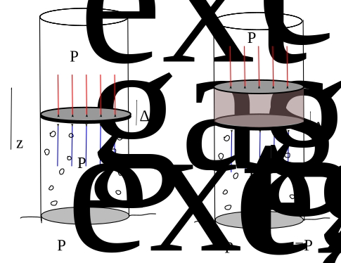
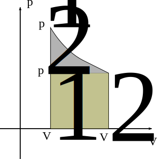

# 𑗕 Work of pressure

Pressure, denoted by $p$,  is a force acting on the unit area of the body in the normal direction, and Pascals $Pa:=N/m^2$ is its SI unit. In terms of mechanics, it is an isotropic part of total stress. Thermodynamically speaking, pressure is a state variable.

Let $\mathbf{n}$ be the outward normal to the surface of area $\Delta s$, then the force acting on the surface due to the pressure is given by the following expression.

$$
\mathbf{f}=-pds \mathbf{n}
$$

The magnitude of this force is $pds$, noting that pressure is always greater than zero.

## Derivation of work done by pressure

Consider a closed cylindrical system, as shown in Figure 1. The walls of the cylinder are adiabatic. The piston is frictionless, and it can move up and down. Now let us consider a process in which we move the piston very slowly. This means that at any point $p_{ext}=p_{gas}$. Here note that the gas cannot exchange heat with the surroundings. Therefore, the decrease in the system's internal energy is equal to the work done by the system.

$$
\Delta u = -W
$$

|                                       |
|:-------------------------------------:|
|  |
|        Work of pressure forces        |

As piston moves up, volume of the cylinder increases, and the gas expands. The infinitesimal work done by the system is given by following expression.

$$
dW=p_{ext}Adz=p_{gas}Adz=pdV
$$

Where, $dV=Adz$, and $p_{gas}=p_{ext}=p$.

Note that the work done by the system is equal and opposite of the work done by the surrounding. To get the total work done by the system we integrate the above expression, and obtain the following result.

$$
\Delta W = \int_{V_1}^{V_2}{pdV}
$$

## Reversible process

In the derivation mentioned above of work done by the pressure, we have mentioned that the piston moves very slowly. Therefore, external pressure is almost the same as gas pressure at any time. In such a situation, if we increase the external pressure by adding a small perturbation, then the piston will slightly move down and increase the gas pressure and attain equilibrium. Similarly, if we increase the gas pressure, the piston will move up. Consequently, the gas pressure will decrease and piston will attain equilibrium. Such processes are reversible as the process can go either way to ensure the equilibrium between the system and surroundings. In this way, during the upward motion of the system (gas inside the cylinder), it remains in local equilibrium with its surrounding. Later, we will demonstrate that reversible processes are the best way to minimize the wastage of energy in the system.

## Work done against constant pressure

Note that in the above discussion, we ensure the reversibility of the process by changing the external pressure such that $p_{ext}=p_{gas}$. Now consider a situation in which the external pressure remains constant during the process. In this situation, the work done by the system is given by the following expression.

$$
W=p_{ext} \Delta V=p_{ext} (V_2 - V_1)
$$

Based on the above results it is clear that the work done by the system during the free expansion is zero. An example of free expansion is expansion of gas in vacuum.

## Isothermal reversible expansion of an ideal gas

The equation of state of an ideal gas is given by

$$
pV=nRT, \quad p=\frac{nRT}{V}
$$

During an isothermal process $T$ remains constant. Therefore, the reversible work done during an isothermal process is given by following expression.

$$
W = nRT\int_{v_1}^{V_2}{\frac{1}{V}dV}=nRT\ln \frac{V_2}{V_1}
$$

!!! note ""
    Graphically, the work is denoted by the area under the PV curve as shown in Figure 2.

From the above expression of work, it is clear that the work done by the system increases with the temperature. Now, consider the pressure at the final stage, that is, when the volume of the system is $V_2$,

$$
p_2=\frac{nRT}{V_2}
$$

Considering a process in which pressure is suddenly dropped from $p_1$ to $p_2$, and then kept constant. In this case expansion will occur under constant pressure, and the work done by the system is given by the following expression. This work done is equal to the rectangular area in Figure 2.

$$
W_{p2}=p_2 (V_2-V_1)
$$

!!! note ""
    The work done in a reversible process is greater than the work done during an irreversible process.

| |
|:---: |
|  |
| Graphical representation of work |
