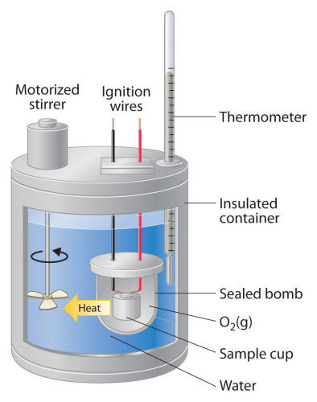

# 𑗕 Calorimetry

**Calorimetry** is the study of energy transfer via heat during a physical or chemical processes. For example we may be interested in knowing the calorific value of a fuel, or we may be interested in knowing the energy absorbed during the melting of ice. The device called *calorimeter* is used to measure the energy transfer as heat. The most common calorimeter is a [bomb calorimeter](https://chem.libretexts.org/Bookshelves/Physical_and_Theoretical_Chemistry_Textbook_Maps/Supplemental_Modules_(Physical_and_Theoretical_Chemistry)/Thermodynamics/Calorimetry/Constant_Volume_Calorimetry).

|                                      |
|:------------------------------------:|
|  |
|           Bomb calorimeter           |

Following video explains the step by step procedure of an oxygen gas bomb calorimeter.

<iframe width="560" height="315" src="https://www.youtube.com/embed/RzAPQPWOlNI" title="YouTube video player" frameborder="0" allow="accelerometer; autoplay; clipboard-write; encrypted-media; gyroscope; picture-in-picture" allowfullscreen></iframe>

In a calorimeter volume of the system remains constant. Therefore, work done by the system is zero, and we obtain following relation between the heat supplied to the system and change in its internal energy.

$$
\Delta U = q
$$

Therefore, if we know the amount of energy supplied to the system as heat, then we can calculate the change in its internal energy. In other words, measuring the energy supplied as heat to a system at constant volume is equivalent to measuring the change in internal energy of the system.
