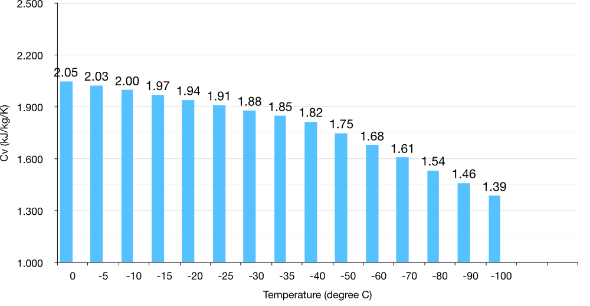

# 𑗕 Heat capacity

The system's internal energy increases when the system's temperature increases. However, the actual value of increment in internal energy depends upon the process through which the system's temperature has been increased.

In an isochoric process (volume of the system remains constant), the work done by the system is zero. Therefore, all the energy supplied to the system as heat is used to increase its internal energy. $C_v$ will denote the heat capacity at constant volume, and the following expression gives its mathematical definition.

$$
C_v = \left ( \frac{\partial U}{\partial T} \right )_V
$$

In this way, the heat capacity denotes the slope of $U$  vs. $T$ at any temperature $T$. Note that if the material's heat capacity is constant within a range of temperature, then internal energy will vary linearly with temperature in that range. In general, a material's heat capacity can increase or decrease with temperature change.

**Example:** The molar internal energy of an ideal gas is given by

$$
U_m(T) = \frac{f}{2} RT
$$

where, $f$ is total number of degree of freedom of the a gas molecule. Then we can define molar volumetric heat capacity of this gas, $c_{V,m}$, as:

$$
c_{V,m} = \frac{f}{2} R
$$

Heat capacity, $C_V$, of a material is an extensive quantity, molar heat capacity $c_{V,m}$ is an intensive property.

- Molar heat capacity is the heat capacity of 1 mole of the substance.
- Specific heat capacity is the heat capacity of 1 gm of a substance.
- The specific heat capacity of water at room temperature is about 4.2 kJ/kg/K or 4.2 J/g/K.

For a constant volume system:

$$
dU = C_{V} dT
$$

Therefore,

$$
\Delta U = \int_{T_1}^{T_2} C_{V} dT
$$

If we assume $C_V$ is constant within the temperature range from $T_1$ to $T_2$, then

$$
\Delta U = C_{V} (T_2 - T_1)
$$

In an isochoric process $\Delta U = Q$, therefore,

$$
C_{V} = \frac{Q}{T_2 - T_1}
$$

!!! note ""
    Volumetric heat capacity of a system is the amount of energy transferred to a system as heat for increasing its temperature by 1 K, while keeping the system's volume constant.

## Specific heat capacity of metals

Metals have low value of heat capacity.

|     Name     | Value (kJ/kg/K) |
| :----------: | :-------------: |
|   Aluminum   |      0.91       |
| Carbon Steel |      0.49       |
|  Cast Iron   |      0.46       |
|     Gold     |      0.13       |
|     Iron     |      0.45       |
|   Silicon    |      0.71       |
|    Silver    |      0.23       |
|    Sodium    |      1.21       |

## Specific heat capacity of Liquid water

The specific heat capacity of water is very high.

|       Material       | Value (kJ/kg/K) |
| :------------------: | :-------------: |
| Water (25 degree C)  |       4.2       |
| Water (100 degree C) |      2.08       |
|                      |                 |

## Specific heat capacity of Ice

 $C_V$ of ice is half of the liquid water, and it decreases with lowering down the temperature as depicted by the data given below. The data given below is taken from this [website](https://www.engineeringtoolbox.com/ice-thermal-properties-d_576.html).

| Ice (degree C) | Cv (kJ/kg/K) |
| :------------: | :----------: |
|       0        |    2.050     |
|       -5       |    2.027     |
|      -10       |    2.000     |
|      -15       |    1.972     |
|      -20       |    1.943     |
|      -25       |    1.913     |
|      -30       |    1.882     |
|      -35       |    1.851     |
|      -40       |    1.818     |
|      -50       |    1.751     |
|      -60       |    1.681     |
|      -70       |    1.609     |
|      -80       |    1.536     |
|      -90       |    1.463     |
|      -100      |    1.389     |
|                |              |

| |
|:---:|
|  |
| Figure: Variation of Cv of ice with temperature |

## Specific heat capacity of geomaterials

- TODO #9
