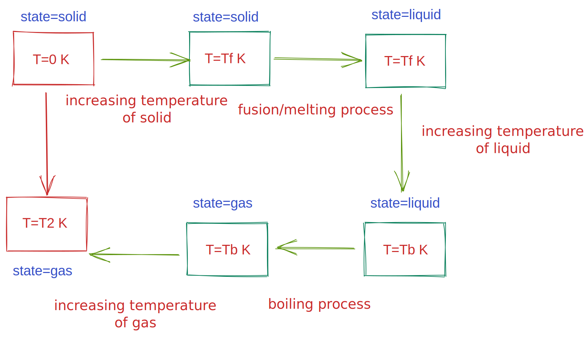

# 𑗕 Measurement of entropy

The entropy of a substance can be measurement by calorimetric measurements of the heat required to raise the temperature of a sample from $T=0$ to the temperature of interest.

During the journey of increasing the temperature of the substance two processes can happen.

1. The energy supplied to the substance as heat is used to increase the temperature of the substance.
2. The energy supplied to the substance as heat is used to change the phase of the substance while keeping its temperature constant (isothermal phase transition)

In the first case, usually the pressure remains constant, therefore,

$$
S(T_2)=S(T_1) + \int_{T_1}^{T_2}{\frac{C_p}{T} dT}
$$

In the second case, entropy is calculated from the change in [enthalapy](../Ch2/enthalapy.md) of phase transition. Remember, during the phase transition pressure remains constant. In this case,
$$
\Delta S_{trans}=\frac{\Delta H_{trans}}{T_{trans}}
$$

!!! note "The Nernst heat theorem"
    The entropy change accompanying any physical or chemical transformation approaches zero as the temperature approaches zero provided all the substances involved are perfectly ordered.

It follows from Nernst theorem that all perfect crystalline compounds also have zero entropy at T=0.

!!! success "The third law of thermodynamics"
    The entropy of all perfect crystalline substances is zero at $T=0$, i.e., $S(0)=0$

!!! note "Residual entropy"
    In some cases, at T=0, there is no advantage in adopting a particular orientation even at absolute zero. In such cases, it is possible to have $S(0)>0$, which is called the **residual entropy**

For example, if a substance melts at $T_{f}$ and boils at $T_{b}$ , then its molar entropy at a particular temperature $T_{2}>T_{b}$ is given by

$$
S_{m}=S_{m}(0)+\int_{0}^{T_{f}}{\frac{C_{p,m}}{T}}dT + \frac{\Delta H_{fus}}{T_{f}} + \int_{T_{f}}^{T_{m}}{\frac{C_{p,m}}{T}}dT + \frac{\Delta H_{vap}}{T_{b}} + \int_{T_{m}}^{T_{2}}{\frac{C_{p,m}}{T}}dT
$$

!!! note "Debye extrapolation"
    There is one major problem in computing entropy from heat capacity, that is, how to measure heat capacities of substances near absolute zero temperature. According to Debye extrapolation (or, Debye's $T^3$ law), the heat capacity of a non-metallic **solid** is proportional to $T^3$ near the absolute zero temperature, that is, near absolute zero, $C_{p,m}=aT^{3}$.

Standard entropies at 298 K

| Substance              | S (J/K/mol) |
| ---------------------- | ----------- |
| Graphite, C(s)         | 5.7         |
| Diamond, C(s)          | 2.4         |
| Water, H2O (l)         | 69.9        |
| Methane, CH4 (g)       | 186.3       |
| Carbon dioxide, CO2(g) | 213.7       |
|                        |             |

> Solid phase has smaller value of entropy than the liquid phase.
