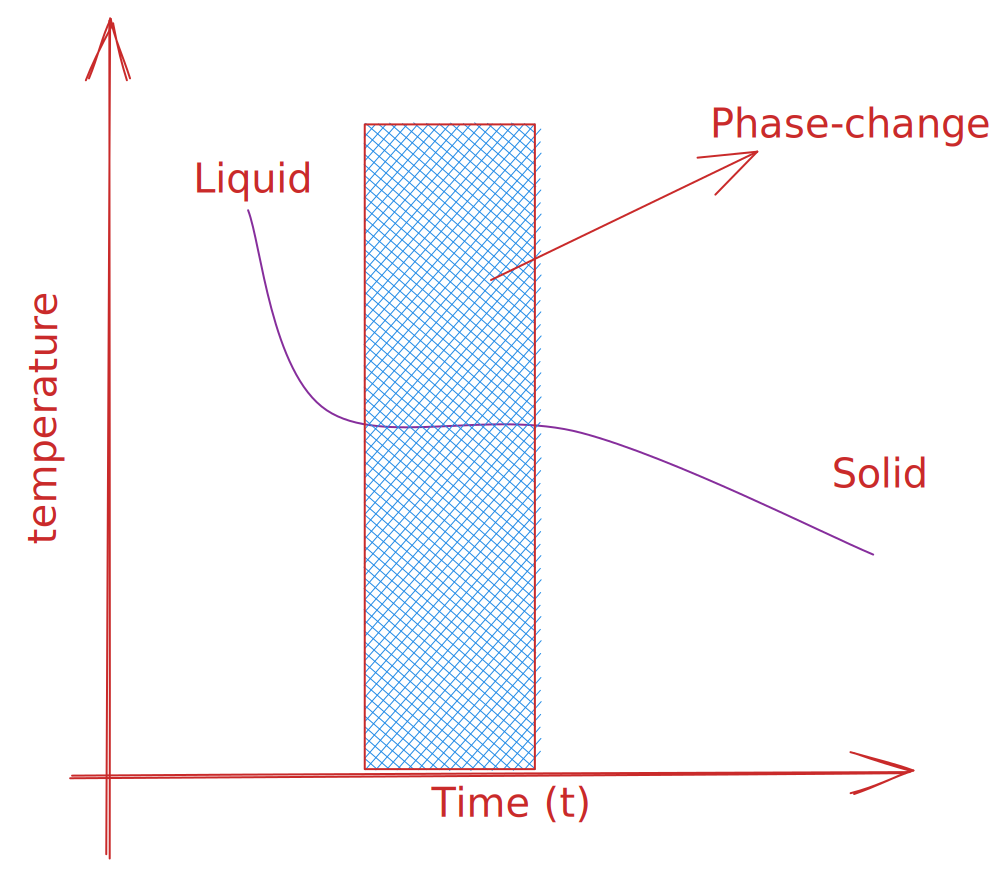

# 𑗕 Thermodynamics of phase change processes

A **Phase** is a form of matter that is uniform in chemical composition and physical state. From the engineering perspective, there are three most important phases of a substance, the solid, the liquid, and the gaseous phase. Now, let us ask a question to ourselves, given a pressure and temperature value, what phase(s) of a substance is stable. The answer of questions related to the stability and transformation of phases are provided by the thermodynamics.

!!! note ""
    An allotrope is a particular form of an element (for example, $O_2$ and $O_3$) and may be solid, liquid, or a gas. A polymorph is one of a number of solid phases of an element or compound.

!!! example ""
    Missible fluids forms a singe phase. Therefore, there is always a single gaseous phase inside a system because almost all gaseous are missible.

!!! note ""
    Ice is a solid phase of water.

!!! example ""
    Two metals form a two-phase system if they are immiscible, but a single phase if they are missible (also known as the alloy).

## Phase transformation

For a given pressure, there may exists a temperature where one phase of a substance transforms into the another phase of the substance. This temperature is called the transition temperature $T_{trans}$. At the transition temperature, the two phases of a substance coexist, and there is an equilirium. Therefore, at the transiition temperature the Gibbs energy is minimum.

The detection of a phase change is not always simple as there may be nothing to see. Thermal analysis, such as [[Differential scannning calorimetery]] which deals with the heat that is evolved or absorbed during a transition, can be used to detect phase change.

!!! note ""
    Freezing of water is an **exothermic** Process.
