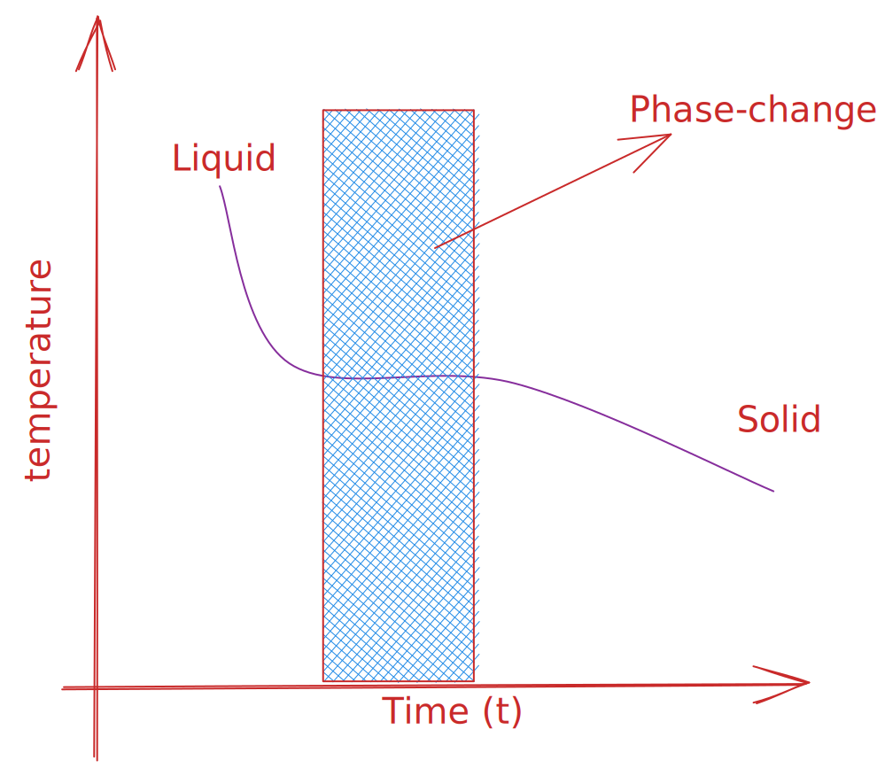

# 𑗕 Phase Diagram

!!! note ""
    The phase diagram of a pure substance shows the regions of pressure and temperature at which its various phases are thermodynamically stable.

## Phase transformation

For a given pressure, there may exists a temperature where one phase of a substance transforms into the another phase of the substance. This temperature is called the transition temperature $T_{trans}$. At the transition temperature, the two phases of a substance coexist, and there is an equilirium. Therefore, at the transiition temperature the Gibbs energy is minimum.

The detection of a phase change is not always simple as there may be nothing to see. Thermal analysis, such as [[Differential scannning calorimetery]] which deals with the heat that is evolved or absorbed during a transition, can be used to detect phase change.

!!! note ""
    Freezing of water is an **exothermic** Process.

## Stability of a phase

In order to determine the stability of a phase, thermodynamics introduces the concept of a chemical potential, which is designated as $\mu$. Fora a system that consists of a single substance, the molar Gibbs energy $G_{m}$ and chemical potential are exactly the same. Like any other potential field defined in Physics (such as gravitational potential, electrostatic potential, etc.), $\mu$ is measure of potential that a substance has for undergoing phase change.

!!! note ""
    At equilibrium, the chemical potential of a substance is the same in and throughout every phase present in the system.

Consider the freezing of water as shown in figure given below. The moles of the water in the shaded region, which denoted the region of freezing, is $\Delta n$. Therefore, due to the freezing the Gibbs energy of the solid region decreases by an amount $\mu_{s} \Delta n$, and the Gibbs energy of the liquid region increases by an amount $\mu_{l} \Delta n$. Then the total change in Gibbs energy is $\Delta G = (-\mu_{s} + \mu_{l}) \Delta n$.

## Liquid-Gas Phase boundary

!!! note ""
    At the phase boundaries in the phase diagram two phases of a pure substance coexist in equilibrium and their chemical potentials are equal.

Consider a liquid sample of a pure substance in a closed vessel. The pressure of a vapour in equilibrium with the liquid is its [[vapour pressure]]. The liquid-vapour phase boundary denotes the value of (vapour) pressure and temperature at which both vapour and liquid phase coexist. In this way, this boundary depicts how the vapour pressure changes with the temperature.

!!! example ""
    Vapour pressure of a substance increases with the temperature.

**Boiling vs vapourization**

To understand the process of boiling and vapourization, consider a fluid kept inside an open container under the controlled pressure conditions. At a given temperatre the liquid will vaporize from the surface. And the rate of this process depends upon the temperature and pressure, among others. However, when the temperature of the system is such that the vapour pressure of the substance becomes equal to the external pressure, vaporization starts to occur throughout the bulk of the liquid and vapour expend in the surrounding. This condition of free vaporization throughout the liquid is called boiling.

!!! note "Boiling temperature"
    The temperature at which the vapour pressure of the liquid becomes equal to the external pressure is called the boiling temperature.

!!! example "Normal boiling point"
    Boiling temperature of liquid at external pressure of 1 atm.

!!! example "Standard boiling point"
    Boiling temperature of liquid at external pressure of 1 bar = 0.987 atm.

!!! warning ""
    Standard temperature of liquid is slightly lesser than the normal boiling temperature.

When the liquid is heated inside a rigid closed container boiling does not occur. This is because, the vapour cannot escape and remains at the top of the liquid surface. The vapour pressure acts as an external pressure. As the temperature increases, both the vapour-density and -pressure increases. Also, due to thermal expansion, the density of the liquid slightly decreases. Eventually, the density of liquid and vapour becomes identical and the interface between liquid and gas disappears. The temperature at which the surface disappears is called **the critical temperature** $T_c$ of the substance. The vapour pressure at the critical temperature is called the **critical pressure** $p_{c}$. At and above the critical temperature, a single uniform phase called a supercritical fluid fills the container and an interface no longer exists.

## Solid-Liquid phase boundary

The temperature corresponding to the Solid-liquid phase boundary is called the melting or freezing point of a substance. Normal melting point is defined at pressure of 1 atm, and Standard melting point is defined at the pressure of 1 bar.

## Triple point

Triple point is the value of pressure and temperature at which all phases of a substance coexist.

!!! info ""
    The triple point of water lieas at 273.16 K and 611 Pa pressure.

## Gibbs phase rule

If a system has a total $C$ components and $P$ phases, then the total number of independent variables $F$ required to represent the system are given by

$$
F=C-P+1
$$

The proof is given below.

- Pressure and temperature are two unknowns
- There are $P$ phases
- Each phase contains $C$ component
- The mole fraction of component $i$ in phase $\alpha$ is denoted by $X_{i}^{\alpha}$
- But $\sum_{i=1}^{C} X_{i}^{\alpha} = 1$
- Therefore, additional number of unknows at this point are $P(C-1)$
- Total unknowns are $P(C-1)+2$
- Let us denote by $\mu_{i}^{\alpha}$, the chemical potential of $i$ component in $\alpha$ phase
- Then chemical equilibrium of each component should be same in all $P$ phases, that is $\mu_{i}^{\alpha} = \mu_{i}^{\beta}$
- This will give us additional $(P-1)C$ constraints.
- In addition, we have a state equation
- Total constraints are $(P-1)C+1$
- Therefore, $F=P(C-1) + 2 - C(P-1) - 1=C-P+1$

Please see these videos to get more insight into boiling and vaporization.

<iframe width="560" height="315" src="https://www.youtube.com/embed/QvQBlRXQtWc" title="YouTube video player" frameborder="0" allow="accelerometer; autoplay; clipboard-write; encrypted-media; gyroscope; picture-in-picture" allowfullscreen></iframe>

<iframe width="560" height="315" src="https://www.youtube.com/embed/i0Frx_bPsT8" title="YouTube video player" frameborder="0" allow="accelerometer; autoplay; clipboard-write; encrypted-media; gyroscope; picture-in-picture" allowfullscreen></iframe>

<iframe width="560" height="315" src="https://www.youtube.com/embed/Sx_8dJ633wg" title="YouTube video player" frameborder="0" allow="accelerometer; autoplay; clipboard-write; encrypted-media; gyroscope; picture-in-picture" allowfullscreen></iframe>

Following videos explains the phenomena of critical point.

<iframe width="560" height="315" src="https://www.youtube.com/embed/RmaJVxafesU" title="YouTube video player" frameborder="0" allow="accelerometer; autoplay; clipboard-write; encrypted-media; gyroscope; picture-in-picture" allowfullscreen></iframe>

## Phase diagram of CO2

### Key features

!!! note ""
    The **solid-liquid** phase boundary has a positive slope: the melting point for CO2 increases with pressure (this is true for many substances, water is one of the exceptions)

!!! example ""
    **Triple point** is well above 1 atm. It means that the CO2 **cannot** exist as a liquid under normal pressure conditions.

!!! note ""
    When the temperature of CO2 is decreased at 1 atm, it converts into the solid state.

!!! example ""
    Likewise, solid CO2 does not melt at 1 atm pressure but instead sublimes to yield gaseous CO2.

!!! note ""
    **Critical point** for CO2 is observed at a relatively modest temperature ($T_{c}=304.2K (31 {}^{\circ}C)$) and pressure ($p_{c}=73.0$ atm) in comparison to water. This means that at $T>T_{c}$, by increasing pressure $p>p_{c}$ we can obtain the supercritical state of CO2.

!!! example ""
    Supercritical state is intermediate between liquid and gaseous phase. Like a gaseous phase supercritical fluid will occupy the entire space of the container. Like liquid, it can dissolve nonvolatile solutes. There is almost no surface tension and very low viscosity. Therefore, it can percolate easily inside small pores and remove soluble components. Supercritical carbon dioxide has become a very popular solvent in the food industry, being used to decaffeinate coffee, remove fats from potato chips, and extract flavor and fragrance compounds from citrus oils.

See following videos:

<iframe width="560" height="315" src="https://www.youtube.com/embed/P9EftqFYaHg" title="YouTube video player" frameborder="0" allow="accelerometer; autoplay; clipboard-write; encrypted-media; gyroscope; picture-in-picture" allowfullscreen></iframe>

Extraction of caffeine from coffee beans

<iframe width="560" height="315" src="https://www.youtube.com/embed/TvmM6qa2a90" title="YouTube video player" frameborder="0" allow="accelerometer; autoplay; clipboard-write; encrypted-media; gyroscope; picture-in-picture" allowfullscreen></iframe>

## Phase diagram of water

- [ ] Write key features of phase diagram of water
